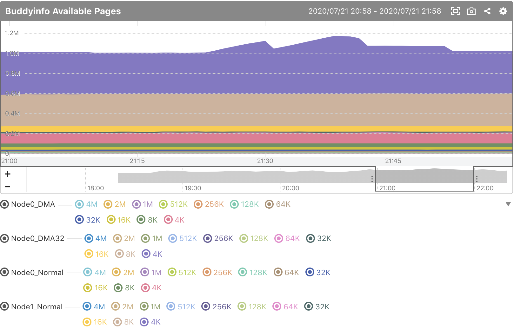
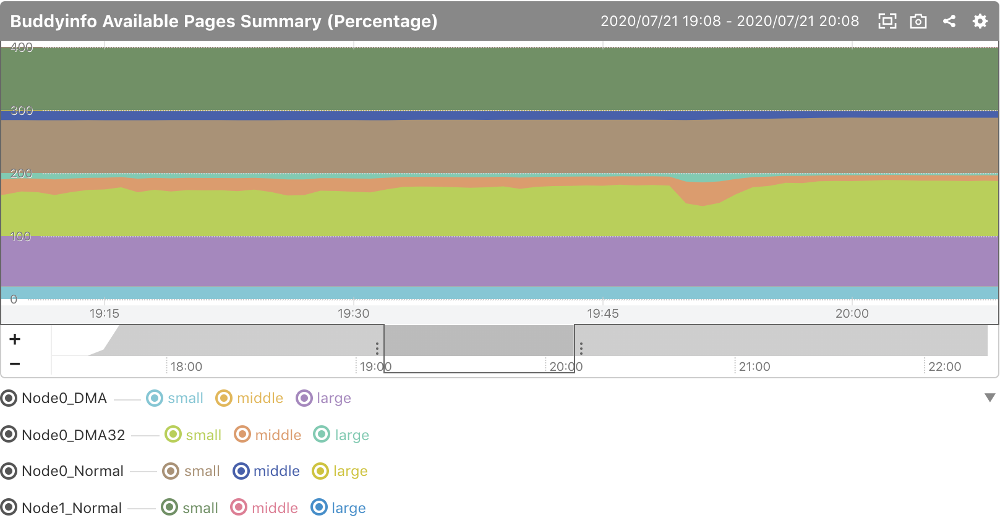
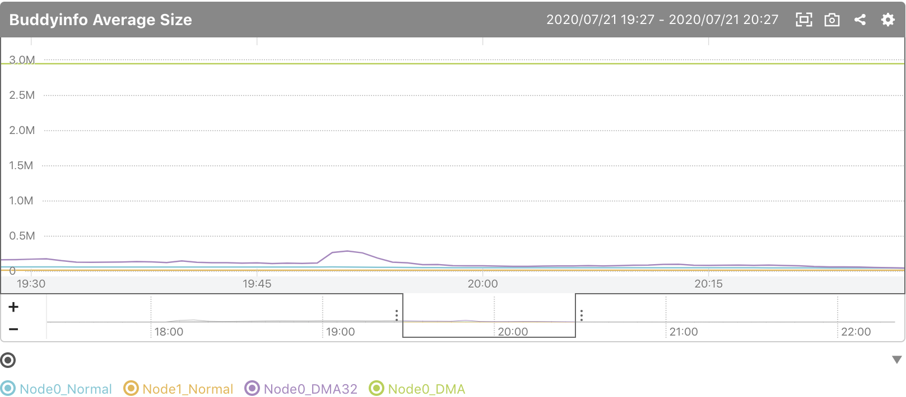

mackerel-plugin-buddyinfo
=====================

Linux buddyinfo custom metrics plugin for [mackerel.io](https://github.com/mackerelio/mackerel-agent) agent.

mackerel-plugin-buddyinfo is hoping to help in investigating of Linux OS error `page allocation failure`.

## Graph examples

### buddyinfo.available_pages.#.{{page_size}}

The numbers of available pages of each chunks. **This can be output with `-verbose` option.**

`#` is node + zone name.



Since this graph is too informative, we recommend that you use the following graphs.

### buddyinfo.available_pages_summary_pct.#.{{category}}

Shows the percentages of available_pages categorized by size.

`#` is node + zone name.

Category:

- small: 4K, 8K, 16K, 32K
- middle: 64K, 128K, 256K, 512K
- large: 1M, 2M, 4M




### buddyinfo.average_size.#

Shows the average chunk sizes of available_pages. When the value is low, memory fragmentation is in progress.

`#` is node + zone name.




## Install

Install [mkr](https://github.com/mackerelio/mkr), and run:

```shell
mkr plugin install livesense-inc/mackerel-plugin-buddyinfo
```

## Example of mackerel-agent.conf

```
[plugin.metrics.buddyinfo]
command = ["/opt/mackerel-agent/plugins/bin/mackerel-plugin-buddyinfo"]
```

## Synopsis

```shell
mackerel-plugin-odfe [-tempfile=<tempfile>] [-metric-key-prefix=<prefix>] [-verbose]
```

NOTE:

* `-verbose` option produces too many metrics. Be careful.
* This plugin outputs metrics with `buddyinfo.` prefix. You can change it by `-metric-key-prefix` option. 
